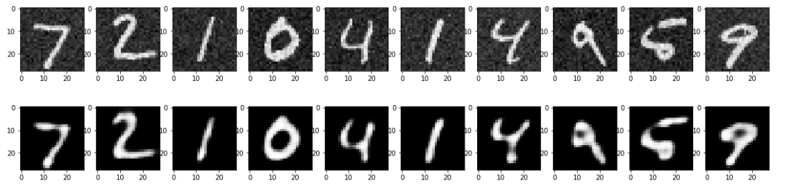

# CNN-Autoencoder-for-image-denoising
This notebook shows the preocess of designing CNN -autoencoder and using itfor image denoising .
Libraries used --
1) Numpy
2) Tensorflow

Observations --
1) Training the same model for both clear and noisy images helps the autoencoder to learn better encoding for the image .
2) It makes it more robust and perform better .

The noisy images and their corresponding output from the autoencoder are given :

   
